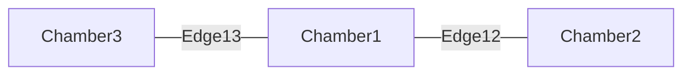
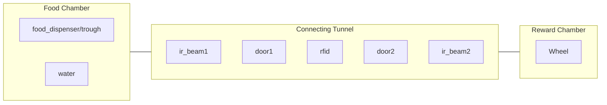

# Classes

## InteractableABC

### Accounting for a Simulated Interactable

    interactable.isSimulation(): Boolean

This function returns True if the interactable is being simulated, False otherwise.

These "simulation checks" should be called in any method that accesses hardware components. In doing so, we can write simple logic for what to do if the interactable is being simulated.

For example, within a door's open() function we write:

    if door.isSimulation() is True: 
        # simulation is running, set new switch state and return 
        door.buttonObj = True 
        return 
    else: 
        # door hardware is present, continue with normal execution...

## Map Class

    Map class represents the physical layout of the box, and has access to all of the physical (or simulated) objects that control the box. Map class packages up all of the hardware objects into a single object that can be accessed by a Control Mode or a Simulation Script. 

    all maps are made up of a series of Vertices and Edges, where the Vertices are represented by the Chamber class and the Edges are represented by the Edge class. 

#### Example: Operant Map

    All hardware components are assigned to a location within an edge or chamber. A component comes in two forms: a plain Component class or a ComponentSet. A Component class contains a singular interactable. Every interactable is some subclass of InteractableABC. A ComponentSet, on the otherhand, is assigned to every chamber and contains a set of interactables. In the below example, the food_dispenser and water belong to a ComponentSet, because the order that a vole accesses these is not important. Any interactable that an edge references, or exists on an edge is contained by a Component object, because the order that vole accesses these does matter. 

#### Example: Home Cage Map

## ModeABC
